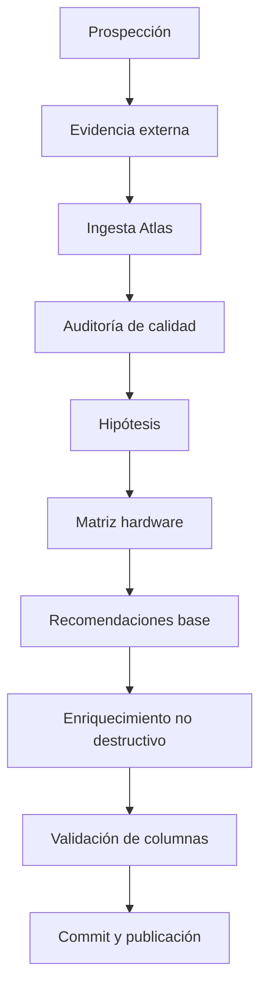

# Arquitectura — Atlas → recomendador diario enriquecido

**Estado: PROVISIONAL / EN VALIDACIÓN**

## 1. Componentes

| Componente | Responsabilidad |
|---|---|
| `scripts/prospectors/*` | descubrir modelos y componentes del ecosistema |
| `atlas_external_evidence.py` | construir evidencia externa |
| `atlas_ingest_ndjson.py` | ingerir descubrimientos |
| `atlas_quality_audit.py` | detectar problemas de calidad |
| `atlas_hypotheses.py` | generar hipótesis desde evidencia |
| `atlas_hardware_matrix.py` | generar perfiles hardware |
| `atlas_recommend_from_feed.py` | generar recomendaciones base |
| `atlas_recommendation_enrich.py` | añadir dimensiones sin destruir columnas existentes |
| `atlas/schema.json` | contrato estructural del registro Atlas |
| `atlas-pipeline.yml` | orquestación diaria y publicación |

## 2. Flujo



## 3. Unidad de información

La recomendación deja de ser únicamente una fila de ranking. El sistema conserva varias dimensiones independientes:

```text
                         CANDIDATO
                            │
       ┌────────────────────┼─────────────────────┐
       ▼                    ▼                     ▼
      JGB                  CABE                  RULA
 apertura/libertad      viabilidad             utilidad
       │                    │                     │
       └────────────────────┼─────────────────────┘
                            ▼
                  rendimiento observado
                            │
             ┌──────────────┼──────────────┐
             ▼              ▼              ▼
         memoria          runtime        backend
             │              │              │
             └──────────────┼──────────────┘
                            ▼
                       evidencia
                            │
                       incertidumbre
```

## 4. Fronteras

### Atlas

Conserva conocimiento, procedencia y estados de evidencia.

### Recomendador

Combina información para responder a una necesidad concreta.

### Runtime

Es una dimensión de ejecución. El mismo modelo puede comportarse de forma diferente con diferentes runtimes/backends.

### Hardware

No es solo RAM/VRAM. Incluye CPU/GPU, memoria, ancho de banda, almacenamiento, interconexión y rutas de offloading cuando están disponibles.

## 5. No destructividad

El enriquecimiento funciona sobre la salida ya generada:

```text
CSV existente
   │
   ├── conservar columnas originales
   │
   └── añadir columnas de enriquecimiento ausentes
                       │
                       ▼
                 CSV enriquecido
```

## 6. Estados de conocimiento

El sistema debe poder distinguir como mínimo:

```text
reported → reproducible → verified
     │          │            │
     └──────────┴────────────┴── no equivalentes
```

La evidencia externa no se convierte automáticamente en medición LEONES.
