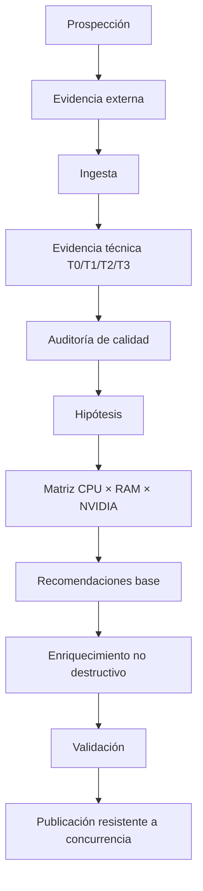

# Arquitectura — H10 Atlas → recomendador diario enriquecido

**Estado: 🟢 ACEPTADA**

## 1. Componentes

| Componente | Responsabilidad |
|---|---|
| `scripts/prospectors/*` | descubrir modelos y componentes del ecosistema |
| `atlas_external_evidence.py` | construir evidencia externa |
| `atlas_ingest_ndjson.py` | ingerir descubrimientos |
| `atlas_technical_evidence.py` | construir perfiles técnicos T0/T1/T2/T3 |
| `atlas_quality_audit.py` | detectar problemas de calidad |
| `atlas_hypotheses.py` | generar hipótesis desde evidencia |
| `atlas_hardware_matrix.py` | generar la matriz CPU × RAM × NVIDIA/VRAM |
| `atlas_recommend_from_feed.py` | evaluar candidatos para perfiles concretos |
| `atlas_recommendation_enrich.py` | añadir dimensiones sin destruir columnas existentes |
| `atlas/schema.json` | contrato estructural del registro Atlas |
| `atlas-pipeline.yml` | orquestación diaria y publicación |

## 2. Flujo aceptado



## 3. Unidad de información

La recomendación no es una única puntuación. Conserva dimensiones independientes:

```text
                         CANDIDATO
                            │
       ┌────────────────────┼─────────────────────┐
       ▼                    ▼                     ▼
      JGB                  CABE                  RULA
 apertura/libertad      viabilidad             utilidad
       │                    │                     │
       └────────────────────┼─────────────────────┘
                            ▼
                  rendimiento observado
                            │
             ┌──────────────┼──────────────┐
             ▼              ▼              ▼
         memoria          runtime        backend
             │              │              │
             └──────────────┼──────────────┘
                            ▼
                       evidencia
                            │
                       incertidumbre
```

## 4. Contrato T0/T1/T2/T3

```text
T0 → T1 → T2 → T3
```

- **T0:** evidencia técnica insuficiente.
- **T1:** identidad técnica estructurada.
- **T2:** viabilidad calculable a partir de evidencia como pesos observados y runtime; no exige contexto conocido.
- **T3:** T2 + rendimiento observado identificable.

La clasificación no se sustituye por `fit_score`.

## 5. Semántica de contexto

```text
context_supported
        │
        ▼
capacidad demostrada por el modelo
        │
        ├──────────────┐
        ▼              ▼
context_target     unknown
        │
        ▼
context_recommended = min(supported, target)
```

El hardware no puede convertir automáticamente su capacidad máxima en una afirmación sobre el contexto soportado por el modelo.

## 6. Hardware y memoria

La matriz recorre perfiles de RAM de `2/4/8/16/32/64/128 GB`, familias Intel i3/i5/i7/i9 y AMD Ryzen 3/5/7/9, además de la cobertura NVIDIA disponible. GPU VRAM y RAM del sistema se mantienen como recursos separados.

La viabilidad preliminar utiliza el tamaño observado de pesos cuando existe; ese valor no se presenta como consumo total de ejecución. Overhead, KV cache y otros consumos deben permanecer explícitos cuando estén disponibles.

## 7. Fronteras

### Atlas
Conserva conocimiento, procedencia y estados de evidencia.

### Recomendador
Responde a una configuración concreta y calcula una recomendación con los datos disponibles.

### Runtime
Es una dimensión de ejecución; el mismo modelo puede variar según runtime/backend.

### Hardware
Incluye CPU/GPU, RAM/VRAM y, cuando exista evidencia, ancho de banda, almacenamiento, interconexión y rutas de offloading.

## 8. No destructividad

```text
CSV existente
   │
   ├── conservar columnas originales
   └── añadir columnas ausentes
            │
            ▼
      CSV enriquecido
```

## 9. Estados de conocimiento

```text
reported → reproducible → verified
```

Son estados distintos. La evidencia externa no se convierte automáticamente en medición LEONES.

## 10. Controles de fallo

```text
matriz == 0 filas
        ↓
      FAIL

recomendaciones == 0 filas
        ↓
      FAIL

columnas críticas ausentes
        ↓
      FAIL

publicación concurrente
        ↓
 fetch → rebase → retry
```

Estos controles forman parte de la arquitectura aceptada, no son comprobaciones opcionales del operador.

## 11. Resultado de aceptación

Run #18 produjo **32.128 filas de matriz**, **59 ficheros de recomendaciones** y **859 filas validadas**, y publicó correctamente en `main`.

La arquitectura queda aceptada como infraestructura diaria. Las mediciones empíricas fuertes y las capas posteriores siguen siendo trabajo de otros hitos.
